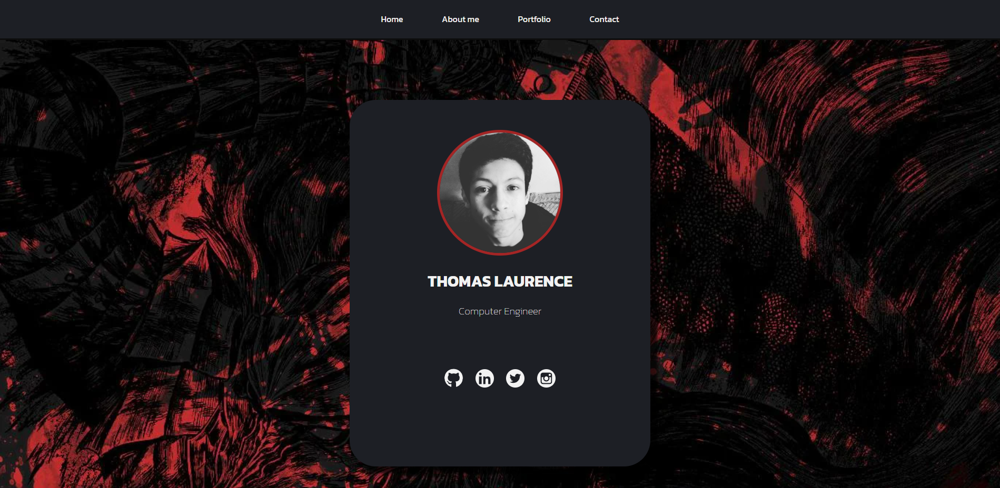

# First Portfolio Web 

Web Portfolio created using vanilla HTML, CSS and JS, testing Netlify to upload the project.

## Installation

As this is a project without frameworks or libraries, no particular installation is required, just execute the index.html.

## Start

My portfolio is running on Netlify on the following link [thLaurence](https://thlaurence.netlify.app/)

## ©️ Copyright

**`LICENSE`**: MIT

Check the file [here](./LICENSE)